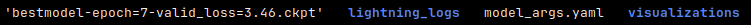
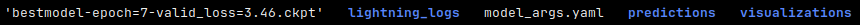
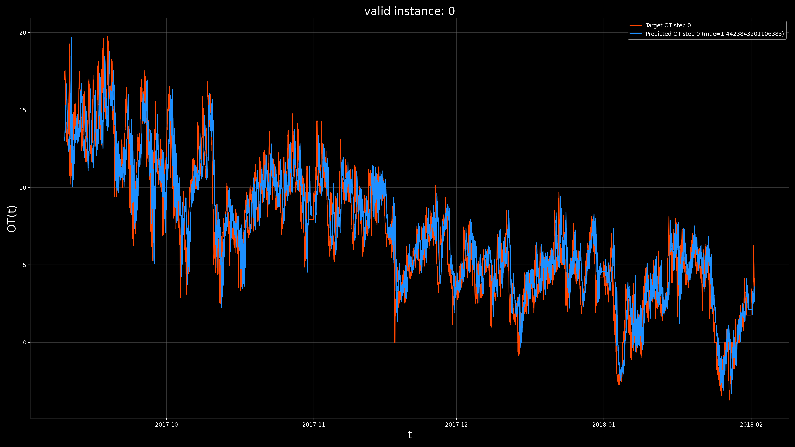
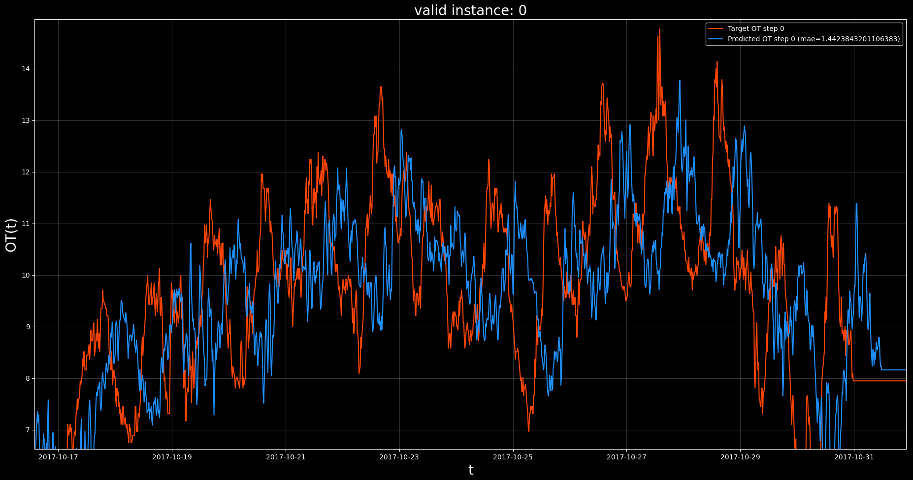
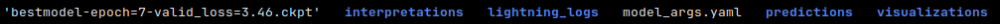

In this tutorial we show how to load, prepare, and import a new dataset into KnowIt, 
as well as train, evaluate, and interpret a new model of this dataset.

1. [Load raw data](#1)

2. [Prepare raw data for importing](#2)

3. [Import data into KnowIt](#3)

4. [Review options](#4)

5. [Train a new model](#5)

6. [Check model predictions](#6)

7. [Interpret model predictions](#7)

---

## 1. Load raw data <div id="1">

We will use the popular [Electricity Transformer Dataset (ETDataset)](https://github.com/zhouhaoyi/ETDataset).

Specifically, we will be looking at the "ETTm1.csv" variant, found under their ETT-small subdirectory. 

This dataset contains various power load features of a transformer, measured at 15min intervals.

Let's start by loading the raw data into pandas dataframes and having a look.

### 1.1. Code

```python
# import the pandas library
import pandas as pd
# import the matplotlib library
import matplotlib.pyplot as plt

# set matplotlib to dark mode :)
plt.style.use('dark_background')

# load the native csv file as a dataframe
df = pd.read_csv('ETTm1.csv')

# print a summary of the dataframe
print(df)

# visualize the dataframe directly
df.plot(alpha=0.7, title='ETTm1')
plt.show()
plt.close()
```
### 1.2. Output


### 1.3. Observations

Given the outputs, we can see that:
 - the data consists of 69680 rows and 8 columns, of which one is a "date" column.
 - the dataframe is not time indexed.
 - the components (assuming columns as components) have different value ranges.

---

## 2. Prepare raw data for importing <div id="2">

In order for data to be imported into KnowIt, it needs to meet the 
conditions defined in ``KnowIt.default_datasets.dataset_how_to.md``.
In this section we adjust the data to meet those conditions.

We do this with the following steps:
 - We check that the dataframe does not contain any NaN values (note, NaNs are allowed, just no all-NaN columns).
 - We ensure that the date column is time indexed.
 - We index the dataframe by the date column.
 - We add meta data to the "attrs" dictionary.
 - We pickle the resulting dataframe; naming it 'ETT_ready.pkl'

### 3.1. Code

```python
# check if the dataframe contains any NaN values
if df.isnull().values.any():
    print('Dataframe contains NaN values.')

# convert the dataframe date column to datetime format
df.date = pd.to_datetime(df.date)
# set the dataframe index to date column
df = df.set_index('date')

# construct and attach the required meta data to the dataframe
#   -   'name' is what the base dataset will be called in KnowIt
#   -   'components' is what columns KnowIt should store as valid components
#   -   'time_delta' is the time period between adjacent time steps in the dataset
df.attrs = {'name': 'ETTm',
            'components': list(df.columns),
            'time_delta': pd.Timedelta(minutes=15)}

# print a new summary of dataframe
print(df)
# print the attributes dictionary
print(df.attrs)

# visualize the dataframe directly
df.plot(alpha=0.7, title='ETTm1')
plt.show()
plt.close()

# store the dataframe in new pickle
df.to_pickle('ETT_ready.pkl')
```

### 2.2. Output


### 2.3. Observations

Given the output, we can see that our prepared dataframe:
 - consists of 69680 rows and 7 columns. The removed column is the previous date column.
 - is time indexed by the date column.
 - contains the correct meta data.

---

## 3. Import data into KnowIt <div id="3">

With our data prepared we can import it into KnowIt.

To do this we first create a KnowIt object and give it an experiment output 
directory (``ETT_exp_dir`` in this case). 
Note that if no directory path is given, a temporary output directory will be maintained 
until the KnowIt object is destroyed.

We then call the ``KnowIt.import_dataset`` function providing the required 
kwarg dictionary (for importing a dataset a 'data_import' kwarg dictionary is required).

See ``KnowIt.user_options.md`` for information on additional kwargs.

### 3.1. Code

```python
# import the KnowIt class
from knowit import KnowIt
# create a KnowIt object linked to a new experiment directory
KI = KnowIt('ETT_exp_dir')
# we switch KnowIt to verbose mode to provide more information
KI.global_args(verbose=True)
# import the prepared data into KnowIt
KI.import_dataset({'data_import': {'path': 'ETT_ready.pkl'}})
```

### 3.2. Output


### 3.3. Observations

Given the output, we can see that:
 - the dataset has been imported successfully.
 - the stored components match our expectations.
 - KnowIt captured, 1 instance, 1 slice, and 69680 potential prediction points. 
This is because we did not define any instances and there were no NaNs or gaps in the dataframe which would have required separate slices or interpolating.
 - the dataset contains only a single 'super instance'. This is because we did not define any instances in this case.
 - the imported dataset is correctly saved with the correct name in the newly created experiment output directory.

---

## 4. Review options <div id="4">

Before training a new model, we might want to review our options.
The following code creates a new KnowIt object (we could also have kept using the previous one) 
and calls the  ``KnowIt.available_datasets()`` function to see what datasets are available to the current 
KnowIt object. It also calls the ``KnowIt.available_archs()`` function to see what architectures are available.
Finally, we call ``KnowIt.summarize_dataset('ETTm')`` to summarize our newly imported dataset.

### 4.1. Code

```python
from knowit import KnowIt
KI = KnowIt('ETT_exp_dir')
print(KI.available_datasets())
print(KI.available_archs())
print(KI.summarize_dataset('ETTm'))
```

### 4.2. Output


### 4.3. Observations

Given the output, we can see that:
 - there are two datasets available to our KnowIt object; the default 'synth_2' dataset and our new custom 'ETTm' dataset.
 - there are four architectures available for training; all defaults.
 - the specifics of our new dataset are as expected.

## 5. Train a new model <div id="5">

In order to train a model of our new dataset we need to call the ``KnowIt.train_model`` 
function, give the model a name and provide three kwarg dictionaries.
We briefly summarize the kwargs used here, see ``KnowIt.user_options.md`` for information on additional kwargs.

**data** &#8594;

The first kwarg dictionary (data) defines how the base dataset should be preprocessed and what task we want to build a model of. 
For simplicity, we will train a model to perform autoregressive univariate time series forecasting on the 
'OT' (Oil temperature) component. Specifically, we want a model that looks at the oil temperature for the previous 24 time steps (6 hours) 
to predict the oil temperature at the 24th time step from the current point in time (6 hours from now). This can be represented as:

[OT(t-24), ..., OT(t)] &#8594; OT(t+24)

or equivalently

[OT(t-48), ..., OT(t-24)] &#8594; OT(t)

These two mappings perform the same task, they are just shifted w.r.t where they are applied.

The data kwargs we choose are as follows:
 - task = 'regression' &#8594; We want target values to be real-valued.
 - 'in_components' = ['OT'] &#8594; We want our model to use the 'OT' component as input.
 - 'out_components' = ['OT'] &#8594; We want our model to produce an output corresponding to the 'OT' component.
 - 'in_chunk' = [-48, -24] &#8594; The model should consider the component values between time delay -48 and -24 as described above.
 - 'out_chunk' = [0, 0] &#8594; The model should output the component values between time delay 0 and 0 as described above.
 - 'split_portions' = [0.6, 0.2, 0.2] &#8594; We want the full dataset to be split into train, validation, and evaluation splits with 
proportions 60%, 20%, and 20%, respectively.
 - 'batch_size' = 64 &#8594; The dataloader used for training should use a batch size of 64.
 - 'scaling_tag' = 'full' &#8594; Both the input and output components should be normalized.
 - 'scaling_method' = 'z-norm' &#8594; Use standardization for normalizing features.

This might seem like a cumbersome approach to defining a simple univariate autoregressive forecasting task, however 
it allows us a lot of freedom in defining alternative tasks on-the-fly.

**arch** &#8594;

The second kwarg dictionary (arch) defines the deep learning architecture that will be trained to form the model.
As a bare minimum, we need to define the architecture name and type of task the model will perform:
 - task = 'regression' &#8594; We want the model output to be real-valued.
 - 'name' = 'TCN' &#8594; We want to use the default TCN based architecture to build our model.

Note that hyperparameters relating to the architecture can also be set by passing an 'arch_hps' kwarg dictionary.
Here we just use the default hyperparameters as defined in the relevant architecture script ``KnowIt.default_archs.TCN``.

**trainer** &#8594;

The third, and final, kwarg dictionary (trainer) defines the training process used to build the model.
It contains details on the optimizer, stopping criterion, and performance metric.

In this example we will use a very basic setup:
 - loss_fn = 'mse' &#8594; Use the mean square error loss function.
 - 'optim' = 'Adam' &#8594; Use the Adam optimizer.
 - 'max_epochs' = 10 &#8594; Train the model for a maximum of 10 epochs.
 - 'learning_rate' = 0.01 &#8594; Use a global learning rate of 0.01.
 - task = 'regression' &#8594; The target and model values should be real-valued.

### 5.1. Code

```python
from knowit import KnowIt
KI = KnowIt('ETT_exp_dir')
# name the new model
model_name = "ETTm_uni_model_tcn"
# define dataset kwargs
data_args = {'name': 'ETTm',
             'task': 'regression',
             'in_components': ['OT'],
             'out_components': ['OT'],
             'in_chunk': [-48, -24],
             'out_chunk': [0, 0],
             'split_portions': [0.6, 0.2, 0.2],
             'batch_size': 64,
             'scaling_tag': 'full',
             'scaling_method': 'z-norm'}
# Define architecture kwargs
arch_args = {'task': 'regression',
             'name': 'TCN'}
# Define trainer kwargs
trainer_args = {'loss_fn': 'mse_loss',
                'optim': 'Adam',
                'max_epochs': 10,
                'learning_rate': 0.01,
                'task': 'regression'
                }
# Initiate trainer and use default visualization for learning curves
KI.train_model(model_name=model_name, 
               kwargs={'data': data_args, 'arch': arch_args, 'trainer': trainer_args}, 
               and_viz=True)
```

### 5.2. Output

The following files are created under ``ETT_exp_dir.models.ETTm_uni_model_tcn``:



The ``model_args.yaml`` contains:


The following visualization is stored under the ``visualizations`` subdirectory.


### 5.3. Observations

See ``result_structure.md`` for details on the output format for the trained model.

Note that our code has produced a visualization of the learning curves captured in the ``lightning_logs`` subdirectory.
See ``helpers.viz.plot_learning_curves`` for the code to generate this visualization.
We note that our training operation has reduced the loss drastically within the first epoch, and then 
stagnated quite quickly. The best model was obtained at the eighth epoch. By default, the model is saved at 
the epoch with the lowest validation loss. If we open the ``lightning_logs`` we see that the exact final validation loss is 0.00008289787.

---

## 6. Check model predictions <div id="6">

Next, we might want to take a more qualitative approach to evaluating the model's performance, 
by visualizing its prediction on data it was not trained on.

We do this by calling ``KnowIt.generate_predictions`` function with the required model name and kwarg dictionary.
The only kwarg dictionary that is required is 'predictor' and we set the desired data split to be predicted on to 
'valid', corresponding to the validation set.


### 6.1. Code

```python
# generate model predictions on the validation set and use default visualization for predictions
KI.generate_predictions(model_name=model_name,
                        kwargs={'predictor': {'prediction_set': 'valid'}},
                        and_viz=True)
```

### 6.2. Output

The following files are now listed under ``ETT_exp_dir.models.ETTm_uni_model_tcn``:



The following visualization is stored under the ``visualizations`` subdirectory.



The previous visualization, zoomed in:



### 6.3. Observations

Note that our code has produced a visualization of the validation set predictions of our trained model.
See ``helpers.viz.plot_set_predictions`` for the code to generate this visualization.

Each point on the horizontal axis represents a prediction point (ordered by time step).
Each point on the vertical axis shows the OT value (rescaled to its native range) as represented by the 
ground truth (red), and predicted by the model (blue), at the current prediction point.

Notice that if we look at the overall predictions (top visualization) it appears that the model, 
is making very accurate predictions in general. However, if we look at the zoomed in visualization (bottom), 
we see that the model tends to output a near copy of the OT, only delayed by some number of 
time steps. From this we suspect that the model is performing a naive forecast, where the forecasted value is 
just the most recently available value in the input chunk.

---

## 7. Interpret model predictions <div id="7">

In order to investigate our suspicion that the model is performing a naive forecast, we can interpret its predictions 
with a feature attribution method. If the feature corresponding to the most recent time step in the input chunk is 
regarded as overwhelmingly more important than the others, it would be a strong indication that we are correct.

To do this we call ``KnowIt.interpret_model`` and provide the required kwarg dictionary (interpreter).
The kwargs we provide are as follows:
 - interpretation_method = 'DeepLift' &#8594; Use [Captum's DeeLift](https://captum.ai/api/deep_lift.html) feature attributions.
 - 'interpretation_set' = 'valid' &#8594; Interpret model prediction on the validation set predictions.
 - 'selection' = 'random' &#8594; Select a random set of contiguous prediction points to interpret.
 - 'size' = 100 &#8594; Select 100 prediction points to interpret.

### 7.1. Code

```python
# set up interpreter kwarg dictionary
interpret_args = {'interpretation_method': 'DeepLift',
                  'interpretation_set': 'valid',
                  'selection': 'random',
                  'size': 100}
# Initiate interpretations and use default visualization methods
KI.interpret_model(model_name=model_name,
                   kwargs={'interpreter': interpret_args},
                   and_viz=True)
```

### 7.2. Output

The following files are now listed under ``ETT_exp_dir.models.ETTm_uni_model_tcn``:



The following visualization is stored under the ``visualizations`` subdirectory.


### 7.3. Observations

Note that our code has produced a visualization of the interpretation's 100 validation set predictions of our trained model.
See ``helpers.viz.plot_feature_attribution`` for the code to generate this visualization.

The top plot shows the full set of interpreted prediction point target (red) and predicted (blue) OT values.
It also shows the input components (green; which in this case is OT itself) at each point where the model makes a prediction.
The dashed lines frame the input chunk and the solid line indicates the prediction point. 
Note that the input chunk is delayed by a number (we know to be 24) of time steps behind the prediction point.

The bottom plot shows a heatmap of the feature attributions assigned to each input feature in the input chunk.
We note that the OT value at a time delay of -48 consistently has higher attribution value, while most 
of the others tend to fluctuate. This suggests that our hypothesis was not entirely correct. Our model seems to be 
basing its prediction a lot on the OT value 12 hours in the past (-48 x 15min) even though it is given OT values for the 
6 hours after that point.


