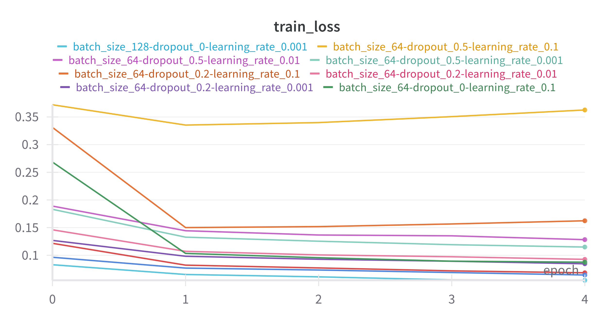
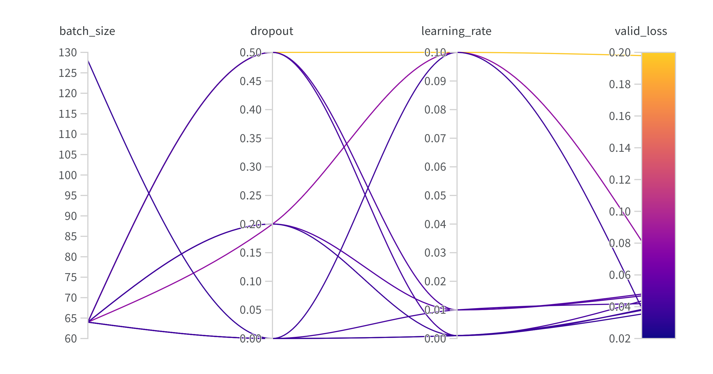

In this tutorial we show how to perform a basic hyperparameter (HP) sweep in the KnowIt framework, 
using the [Weights and Biases (W&B) API](https://docs.wandb.ai/).

1. [Preliminaries](#1)

2. [Define the sweep](#2)

3. [Define the runner](#3)

4. [Start the sweep](#4)

5. [Consolidate the sweep](#5)

6. [Conclusion](#6)


---

## 1. Preliminaries <div id="1">

First make sure you have W&B [installed and you are logged in](https://docs.wandb.ai/guides/integrations/lightning/#install-the-wandb-library-and-log-in).

Let's set up some preliminary variables and imports as defined below.

```python
# import the KnowIt class
from knowit import KnowIt
# import W&B class
import wandb

# create a KnowIt object linked to an experiment directory
KI = KnowIt('sweep_exp_dir')
# connect the sweep with a model-to-be by naming it
model_name = "some_sweeped_model"
# give the current sweep a name
sweep_name = "my_sweep_name"

# W&B variables
project_name = "my_project_name"
entity = "my_wb_username_or_team"
```

Note that the output structure of a KnowIt experiment using HP sweeps is 
still the same as defined in ``result_structure.md``, with the familiar hierarchy of
experiment directory, models, and then model. The model directory now 
contains an additional sub-directory called "sweeps" within which the results of 
HP sweeps are stored. The defined `model_name` and `sweep_name` dictates this. 

---

## 2. Define the sweep <div id="2">

Next we define the HPs that we will be sweeping over.
We do this by constructing a sweep configuration dictionary as defined below.

```python
sweep_config = {"name": sweep_name, 
                "method": "grid", 
                "metric": {"goal": "minimize", "name": "valid_loss"}, 
                "parameters": {"dropout": {"values": [0.0, 0.2, 0.5]}, 
                               "batch_size": {"values": [64, 128, 256]}, 
                               "learning_rate": {"values": [0.001, 0.01, 0.1]}}
    }
```

The value for `name` should correspond to the already defined `sweep_name`.
This is to keep the naming of runs during local logging and remote logging (W&B) 
consistent.

The value for `method` defines the search method used to find good HPs. There are 
currently three options in W&B ([grid, random, and bayes](https://docs.wandb.ai/guides/sweeps/sweep-config-keys/#method)).
We select the grid search in this example.

The value for `metric` defines the [variable](https://docs.wandb.ai/guides/sweeps/sweep-config-keys/#metric) that you want to optimize with the sweep.
Typically, the goal is the minimize the validation loss, as is the case in this example.
If your trainer also logs an additional performance metric (e.g. MAE) which you would like 
to optimize, this is where we would connect it to W&B.

The value for `parameters` is a [dictionary](https://docs.wandb.ai/guides/sweeps/sweep-config-keys/#parameters) defining the HPs that will be searched over.
Note that the options here are very flexible since we will be connecting them to the appropriate 
arguments in KnowIt during the construction of the runner in the next section. These can relate to the training process, 
the model architecture, or even the dataset. In this example we do a basic search over a few options for the dropout coefficient, batch size, and learning rate.

For suggestions on HPs relating to a specific deep learning architecture refer to the `HP_ranges_dict` dictionary 
included in the relevant architecture script under `KnowIt.default_archs`.

**Warning**: While you are free to sweep over virtually any argument in KnowIt, some of 
them would make comparisons between runs of a sweep questionable. For the data arguments, 
we advise that you only search over `batch_size`, `shuffle_train`, and/or `padding_method`. This will 
ensure that all runs are trained on the same training set and tuned with the same validation set.

---

## 3. Define the runner <div id="3">

So far we have set up some preliminaries and defined how the sweep should be performed.
Here we define the function that will execute for each run in the sweep. Here we call this 
function `runner`.

```python
def runner():

    # initialize the new run with W&B
    run = wandb.init()
    # ensure that all the logged metrics are visualized as a function of epoch
    run.define_metric("*", step_metric="epoch")
    
    # get the HPs that are being sweeped over
    hp_dict = wandb.config.as_dict()
    # construct a name for the run based on the choice of HPs for this run
    run_name = ""
    for key in hp_dict:
        run_name += f"{key}_{hp_dict[key]}-"
    run_name = run_name[:-1]
    # rename the default run name
    run.name = run_name

    # define the data, arch, and trainer kwargs as usual for training a 
    # model in KnowIt. Be sure to replace the HPs being sweeped over.
    data_args = {'name': 'synth_2',
                'task': 'regression',
                'in_components': ['x1', 'x2', 'x3', 'x4'],
                'out_components': ['x5'],
                'in_chunk': [-32, 0],
                'out_chunk': [0, 0],
                'split_portions': [0.6, 0.2, 0.2],
                'batch_size': hp_dict['batch_size'],
                'split_method': 'instance-random',
                'scaling_tag': 'full', 
                'rescale_logged_output_metrics': False}
    arch_args = {'task': 'regression',
                'name': 'MLP',
                'arch_hps': {'dropout': hp_dict['dropout']}}
    trainer_args = {'loss_fn': 'mse_loss',
                    'optim': 'Adam',
                    'max_epochs': 5,
                    'learning_rate': hp_dict['learning_rate'],
                    'task': 'regression'}

    # construct the sweep kwargs
    sweep_kwargs = {'sweep_name': sweep_name, 
                    'run_name': run_name, 
                    'log_to_local': True}

    # call the train_model function in KnowIt with the special sweep_kwargs
    KI.train_model(model_name=model_name, 
                   kwargs={'data': data_args, 
                           'arch': arch_args, 
                           'trainer': trainer_args}, 
                   sweep_kwargs=sweep_kwargs)
```

The `sweep_kwargs` dictionary is a special set of optional kwargs that are only 
passed to KnowIt if an HP sweep is being performed. It must contain the following:
 - `sweep_name` - As defined above
 - `run_name` -  As defined above
 - `log_to_local` - If False, the sweep results will only be logged to W&B and no files or metrics will be stored locally.

---

## 4. Start the sweep <div id="4">

The next step is to start the sweep operation. This can be done with the following code.
Note that we limited the number of runs to 10 (with `count=10`) for brevity.

```python
# Initialize the sweep and generate a sweep id number from W&B
sweep_id = wandb.sweep(sweep_config, project=project_name, entity=entity)
# Start the sweep with the given configurations
wandb.agent(sweep_id=sweep_id, function=runner, count=10)
```

The sweep will generate two sets of results, those stored locally and those stored remotely 
using your W&B API.

### 4.1. Local results

The experiment output directory will contain the following subdirectories and files.

```bash
<"sweep_exp_dir">
├── <custom_archs>
├── <custom_datasets>
└── <models>
    └── <"some_sweeped_model">
        └── <sweeps>
               └── <"my_sweep_name">
                    ├── <"batch_size_64-dropout_0.2-learning_rate_0.1">
                    ├── <"batch_size_64-dropout_0.2-learning_rate_0.01">
                    ├── <"batch_size_64-dropout_0.2-learning_rate_0.001">
                    │    ├── ["bestmodel-epoch=4-valid_loss=0.04.ckpt"]
                    │    ├── [model_args.yaml]
                    │    └── <lightning_logs>
                    └── ...
```

Note that our model (`some_sweeped_model`) contains a single sweep (`my_sweep_name`) and this 
sweep contains a number of (10) runs. Each run contains the same outputs that KnowIt generates during 
normal model training.

### 4.2. Remote results

With the W&B API (in your browser) we can have a look at the learning curves for the 10 runs that were 
performed in our sweep.

We observe that none of our models convincingly converged within the very limited 5 epochs of training 
and at least one (yellow) looks like it failed to learn at all.




From the illustration below we can spot a slight preference for a lower learning rate and 
low dropout coefficient, however a more rigorous sweep would be required to be sure.



---

## 5. Consolidate the sweep <div id="5">

At this point we can either run another sweep based on the results from this sweep or select 
our "best" model from the runs that we have already trained. For brevity let's select it from what we have.

### 5.1. Manually
We can do this manually by eye-balling the remote results and picking a good looking run, 
say `batch_size_128-dropout_0-learning_rate_0.001`, and copying the relevant checkpoint, 
model_args.yaml, and lightning_logs to the model directory, as illustrated below. The 
copied files/folders are tagged with "*".

```bash
<"sweep_exp_dir">
├── <custom_archs>
├── <custom_datasets>
└── <models>
    └── <"some_sweeped_model">
        ├── ["bestmodel-epoch=3-valid_loss=0.03.ckpt"]*
        ├── [model_args.yaml]*
        ├── <lightning_logs>*
        └── <sweeps>
               └── <"my_sweep_name">
                    ├── <"batch_size_64-dropout_0.2-learning_rate_0.1">
                    ├── <"batch_size_64-dropout_0.2-learning_rate_0.01">
                    ├── <"batch_size_64-dropout_0.2-learning_rate_0.001">
                    │    ├── ["bestmodel-epoch=4-valid_loss=0.04.ckpt"]
                    │    ├── [model_args.yaml]
                    │    └── <lightning_logs>
                    └── ...
```

### 5.1. Automatically
Alternatively, we can run the following code to automatically select the best model 
from our sweep and copy it for us. This will select the run with the best resulting model, 
based on the best `best_model_score` stored in the model checkpoint. 
In this case, the results for the manual and automatic methods are the same.

```python
KI.consolidate_sweep(model_name, sweep_name)
```

Now, we can regard the model checkpoint in the model directory as our best 
model of the data and we can evaluate it on its evaluation set (if we are happy with it) or 
analyse it further with interpretations.

# 6. Conclusion  <div id="6">

This tutorial has demonstrated how to perform a basic HP sweep in the KnowIt framework.
Notice that it is more of a way of using KnowIt within a W&B protocol, with some features added 
to KnowIt to manage the expected output structure of KnowIt.

This way of performing HP sweeps is very flexible, but be sure to understand what you are 
sweeping over. As mentioned previously, varying some design choices make comparisons between model/runs
problematic.

For more information on how to run HP sweeps using the W&B and Pytorch Lighting interface we suggest 
the following links:
 - [Logging with W&B and PyTorch Lightning](https://docs.wandb.ai/guides/integrations/lightning/)
 - [Tuning HPs with sweeps in W&B](https://docs.wandb.ai/tutorials/sweeps/)
 - [Sweep configurations in W&B](https://docs.wandb.ai/guides/sweeps/sweep-config-keys/)
 - [HP sweep walkthrough in W&B](https://docs.wandb.ai/guides/sweeps/walkthrough/)