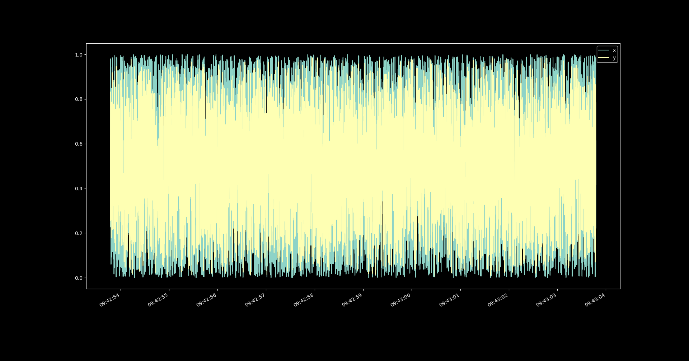

In this tutorial we demonstrate how to train a stateful model in the ``KnowIt`` environment.

A stateful model is one that maintains an internal (or hidden) state across batches.
This is useful (and necessary) for building models that need to take into account long term dependencies in the data.
Specifically, dependencies that reach beyond the ``in_chunk`` of the time series model cannot be learned without 
maintaining information from one batch to the next since batch features are always fixed length and of the shape:

    - x[batch size, size of in_chunk, number of input components]
    - y[batch size, size of out_chunk, number of output components]

By default ``KnowIt`` performs time series modeling in a stateless format, 
where time is guaranteed to be contiguous within prediction points (across the second dimension in ``x`` and ``y``), but not across batches.

To train a stateful model the user should provide the kwarg ``data_args['batch_sampling_mode'] = 'sliding-window'``.
This tells ``KnowIt`` that batches should be constructed in a way so that time is also contiguous across batches.
How the model manages this statefulness is defined in the model architecture. See the default architecture ``LSTMv2`` for 
an example of an LSTM architecture with stateful capabilities.

The following sections provide further details in the form of a tutorial on simple stateful training.

1. [Compile dataset](#1)

2. [Set up baseline model building protocol](#2)

3. [Train a baseline MLP](#3)

4. [Train an MLP with extra history](#4)

5. [Stateful training](#5)

6. [Train a stateful LSTM](#6)

7. [Train a stateless LSTM](#7)

8. ["Long" term memory](#8)

9. [Conclusion](#9)

---
## 1. Compile dataset <div id="1">

First we need a simple dataset for which we know the underlying function.
We define a simple univariate running average ``y(t) = 0.5(x(t) + x(t-1))`` where ``x ∈ U(0, 1)``.
This can be defined with the following method, given ``k = 1``. In other words, 
``y`` at any given point in time is the average between ``x`` at the same point in time 
and ``x`` at the preceding point in time.

```python
# import numpy
import numpy as np
# set a random seed for reproducibility
np.random.seed(123)

# define data generating method
def generate_running_average_data(n, k):
    x = np.random.uniform(0, 1, n)
    y = []
    for t in range(n):
        y.append(0.5 * (x[t-k] + x[t]))
    y = np.array(y)
    return x, y
```

Next, we define a method to compile the data into a dataframe for 
importing into ``KnowIt``. Note that we simulate a time delta of
one millisecond between timesteps.

```python
# import pandas
import pandas as pd
# import the datetime library
import datetime

# define data compiler method
def compile_dataframe(data_name, x, y, component_names):
    # convert the input and output components to two column vectors
    seq_data = np.array([x, y]).transpose()
    # define the time delta between time steps
    freq = datetime.timedelta(milliseconds=1)
    # define a range of datetime indices
    start = datetime.datetime.now()
    end = start + datetime.timedelta(milliseconds=len(x))
    t_range = pd.date_range(start, end, freq=freq)[:len(x)]
    # compile the dataframe
    new_frame = pd.DataFrame(seq_data, index=t_range, columns=component_names)
    # add the required meta data
    meta_data = {'name': data_name,
                 'components': component_names,
                 'time_delta': freq}
    new_frame.attrs = meta_data
    return new_frame
```

Using the two methods above, we can generate, compile, store, and visualize the dataset with the following code.
Note that our generated dataset consists of ``10 000`` timesteps and we called it ``k1_running_average``.

```python
# import matplotlib for visualization
import matplotlib.pyplot as plt

x, y = generate_running_average_data(n=10000, k=1)
new_frame = compile_dataframe(data_name='k1_running_average', 
                              x=x, 
                              y=y, 
                              component_names=['x', 'y'])
new_frame.to_pickle(path='k1_running_average.pickle')

new_frame.plot()
plt.show()
plt.close()
```

The resulting dataset shows no discernible pattern when 
visualized as a whole.



However, when we zoom in, we can see that each value for ``y`` 
is the halfway point between the current ``x`` and the preceding one.


---
## 2. Set up baseline model building protocol <div id="2">

Now that we have an imported dataset ``k1_running_average``, we would like to train a time series model of 
``y(x)``. To do this we first need to define a couple of kwargs. 
The basic kwargs for model training are `data`, `arch`, and `trainer`. 
We define a nifty method ``get_basic_kwargs`` to produce these kwargs below.

In order to keep things simple we first construct our task as predicting ``y(t)`` given 
``x(t)``. We know that a model that can only consider ``x(t)`` to produce ``y(t)`` will be unable 
to fit the true underlying function ``y(t) = 0.5(x(t) + x(t-1))``. We also select the default 
architecture ``MLP``, which produces a stateless model by design. 
See the `Basics` tutorial for an explanation of the other kwargs.

```python
def get_basic_kwargs(data_name):
    # define the data related arguments
    data_args = {'name': data_name,
                 'task': 'regression',
                 'in_components': ['x'],
                 'out_components': ['y'],
                 'in_chunk': [0, 0],
                 'out_chunk': [0, 0],
                 'split_portions': [0.6, 0.2, 0.2],
                 'batch_size': 16, 
                 'scaling_tag': 'full'}

    # define your architecture
    arch_args = {'task': 'regression',
                 'name': 'MLP'}

    # define your trainer
    trainer_args = {'loss_fn': 'mse_loss',
                    'optim': 'Adam',
                    'max_epochs': 50,
                    'learning_rate': 0.0001,
                    'task': 'regression'}

    return data_args, arch_args, trainer_args
```

We also construct an instance of ``KnowIt`` connected to a new experiment output 
directory ``stateful_tut_exp`` and import the newly constructed dataset.

```python
# import the KnowIt class
from knowit import KnowIt

# create an instance of KnowIt connected to an experiment output directory
KI = KnowIt(custom_exp_dir='stateful_tut_exp')
# switch on visualisation by default
KI.global_args(and_viz=True)
# import the raw dataset
KI.import_dataset({'data_import': {'raw_data': 'k1_running_average.pickle'}})
```

Finally, we define a method to train the model and produce predictions on the 
validation set, for analysis.

```python
def train_and_predict(model_name, data_args, arch_args, trainer_args):
    KI.train_model(model_name=model_name,
                   kwargs={'data': data_args,
                           'arch': arch_args,
                           'trainer': trainer_args})
    KI.generate_predictions(model_name=model_name,
                            kwargs={'predictor': {'prediction_set': 'valid'}})
```

Note that we have chosen to use an MLP-based model as our baseline.
We choose this architecture to first indicate the expected level of performance 
when a completely stateless model is trained on the data.
This model has no hope of fitting the true underlying function since it is only 
presented with the input component at the current point in time and has no mechanism of 
remembering previous values. We can later compare the performance of a stateful model with 
the performance of our baseline. 

---
## 3. Train a baseline MLP <div id="3">

All we need to do now is to call the ``get_basic_kwargs`` method, and send the resulting 
kwargs to the ``train_and_predict`` method along with a model name.

Here we call our basline model `simple_mlp`.

```python
data_args, arch_args, trainer_args = get_basic_kwargs('k1_running_average')
train_and_predict('simple_mlp', data_args, arch_args, trainer_args)
```

The resulting model obtained a best validation loss of ``0.0204`` at epoch ``23`` out of ``50``.
If we take a more qualitative look at its performance, through a zoomed in visualization of predictions on the 
validation set, we see that the model was unable to fully capture the underlying function. 
This is expected since we did not present the model with all the required inputs, 
namely ``x(t) and x(t-1)``.


---
## 4. Train an MLP with extra history <div id="4">

As a sanity check, we also train a model where we provide all the required inputs by adding 
the time step preceding the current one to the model's input chunk.

```python
data_args, arch_args, trainer_args = get_basic_kwargs('k1_running_average')
data_args['in_chunk'] = [-1, 0]
train_and_predict('simple_oracle_mlp', data_args, arch_args, trainer_args)
```

The resulting model obtained a best validation loss of ``0.0013`` at epoch ``14`` out of ``50``.
Note that this model obtained a validation loss a magnitude lower than the baseline; it also 
achieved this performance much earlier in training.
This is expected since the problem boils down to calculating the average between the two input features.

Through qualitative inspection, we also see that this model produces outputs much closer to the ground 
truths on the validation set.


---
## 5. Stateful training <div id="5">

Before training a stateful model, it would be prudent to explain some mechanisms used in ``Knowit``.

### 5.1. Batch ordering <div id="5.1">

When constructing batches in the default batch sampling mode, with `data_args['batch_sampling_mode'] = 'independent'`, 
each prediction point is packaged into batches 
in an arbitrary order (prediction points are shuffled if ``data_args['shuffle_train'] = True``).
If our dataset consists of 100 contiguous prediction points [1, 2, ..., 99, 100], 
and our batch size is 4, our first set of batches might look something like:

| batch 1 | batch 2 | batch 3 | ... |
|---------|---------|---------|-----|
| 35      | 28      | 29      | ... |
| 67      | 96      | 86      | ... |
| 7       | 88      | 1       | ... |
| 3       | 43      | 55      | ... |

Take note that, while the order of prediction points within and across batches are arbitrary, the 
order of features corresponding to each prediction point will never be. The order of time steps 
within a sequence corresponding to the input- and output-chunk of each prediction point will be 
in the order that they appear in the base dataset (i.e. chronologically).

When constructing batches in the `sliding-window` mode, with `data_args['batch_sampling_mode'] = 'sliding-window'`, 
the ``CustomSampler`` ensures that a prediction point, 
occupying a certain index in a batch follows contiguously after the prediction point that occupies 
the same index in the preceding batch as far as possible. 
To do this, a sliding window approach is taken. Each batch corresponds to a window of as many 
prediction points as the batch size. The sliding window is then shifted by a `slide_stride` (default is 1) 
prediction points to sample the next batch.
Continuing with the example above, our first set of batches might look something like:

| batch 1 | batch 2 | batch 3 | ... |
|---------|---------|---------|-----|
| 1       | 2       | 3       | ... |
| 2       | 3       | 4       | ... |
| 3       | 4       | 5       | ... |
| 4       | 5       | 6       | ... |

Note some key differences when comparing `sliding-window` and the default `independent` batch sampling mode.
For the latter, each prediction point will only appear once per epoch. 
For the former, the number of times a prediction point 
appears depends on the batch size, total number of prediction points, and the stride used.

Also note that the example above is only the general case. There are several edge cases 
that are handled by the ``CustomSampler``. These include:
 - If there are more than one slice in the dataset.
 - If there are more slices than batch size.
 - Whether ``data_args['shuffle_train']`` is True or False.

The general algorithm for the sliding window approach is as follows. See ``CustomSampler`` for 
exact details.

    1. Get a list of all contiguous slices in the dataset split. These are lists of contiguous prediction points.
    2. Shuffle the order of these slices if 'shuffle_train'=True.
    3. If there are fewer slices than batch_size, add slices by duplicating and shifting existing ones until there are enough.
    4. Shuffle the order of these expanded slices if 'shuffle_train'=True.
    5. If 'shuffle_train'=True, drop a random number (between 0 and 10) of prediction points at the start of each slice.
    6. If slide_stride > 1 subsample these expanded slices accordingly.
    7. Iteratively sample batches from the slices in order to maintain as much contigousness across batch indices as possible.
    8. Resulting batches that are smaller than batch size are dropped.

As a final note, for inference (i.e. validation, evaluation, prediction, and interpretation) 
we use a third batch sampling mode called `inference`. This is always used for inference regardless of the 
batch sampling mode selected for training. This sampling mode performs only steps 1, 6, and 7 above. 
That means no shuffling or expansion is done, ensuring that all prediction points are sampled only once and are presented to 
the model in order. It also means that if there are fewer slices in the dataset than batch size, the actual batch 
size during inference will be smaller.

### 5.2. Handling states <div id="5.2">

By selecting the `sliding-window` batch sampler as described in the previous section we ensure that the model 
receives prediction points in the correct order for maintaining information across batches. However, as mentioned, 
this is only done as far as possible. Some discontinuity is expected, especially with multiple slices and random 
dropping if shuffling is used. This means that it would be unwise (and sometimes impossible) to maintain a single unbroken 
hidden state throughout training. The hidden state should only be maintained when it makes sense (i.e. when the batches 
follow each-other contiguously). Managing the hidden states falls on the architecture being trained.

Models in the ``KnowIt`` framework that have the ability to be stateful must have a `force_reset()` and `update_states(...)` method.
`force_reset` is called by the trainer module before each train, validation, or evaluation loop. It tells the architecture 
to reset all its internal states so that no test set leakage occurs when moving into the new loop.
The `update_states` method receives a tensor of shape `[batch size, 3]`. It represents the IST indices of the prediction points 
in the current batch. It can be used to monitor for breaks in contigiousness across batches. 
See the internal method `update_states` in the default architecture ``LSTMv2`` for an example of this.

Alternatively, if the architecture does not have the two methods above it is assumed to be stateless like 
the default architecture ``MLP``.

---
## 6. Train a stateful LSTM <div id="6">

To demonstrate the capability of a stateful model we train a simple stateful LSTM on the same 
dataset defined in Section 1. Note that we make some modifications to the model building protocol.

Namely, we select the `sliding-window` batch sampling mode, we select the `LSTMv2` 
default architecture, and we train the model for longer. Additionally, we change some of the 
default hyperparameters of `LSTMv2` since this is a very simple dataset and would likely not require 
most of the bells and whistles.

Importantly, we do not provide the model with `x(t-1)` by changing `in_chunk`. This means that
the model only observes `x` at the current point in time for each update.

```python
data_args, arch_args, trainer_args = get_basic_kwargs('k1_running_average')
data_args['batch_sampling_mode'] = 'sliding-window'
arch_args['name'] = 'LSTMv2'
trainer_args['max_epochs'] = 100
arch_args['arch_hps'] = {'stateful': True,
                         'depth': 1,
                         'width': 32,
                         'residual': False,
                         'layernorm': False}
train_and_predict('simple_stateful_lstm_sliding-window', data_args, arch_args, trainer_args)
```
The resulting model obtained a best validation loss of ``0.0010`` at epoch ``100`` out of ``100``, although 
it already reached a validation loss of ``0.0052`` before epoch ``50``.
This level of performance is similar to the MLP with extra history, 
successfully fitting the true 
underlying function, without having access to all the required 
input features at each parameter update. This is only possible by maintaining and updating a hidden state across batches in contiguous order.

Also note the near perfect predictive performance on the validation set, as visualized 
below.


---
## 7. Train a stateless LSTM <div id="7">

As a second sanity check we repeat the previous experiment, but with a stateless LSTM.
This means that the hidden state will be reset each time a batch is passed through the model.

We do this by using an identical training setup, with the only difference being that we provide 
the architecture argument `stateful = False`.

```python
data_args, arch_args, trainer_args = get_basic_kwargs('k1_running_average')
data_args['batch_sampling_mode'] = 'sliding-window'
arch_args['name'] = 'LSTMv2'
trainer_args['max_epochs'] = 100
arch_args['arch_hps'] = {'stateful': False,
                         'depth': 1,
                         'width': 32,
                         'residual': False,
                         'layernorm': False}
train_and_predict('simple_stateful_lstm_sliding-window', data_args, arch_args, trainer_args)
```

The resulting model obtained a best validation loss of ``0.0203`` at epoch ``4`` out of ``100``.
This level of performance is similar to the baseline MLP.
This is expected since both models do not maintain a hidden state across batches, which we 
have established is required to find the true underlying function.

---
## 8. "Long" term memory <div id="8">

As a fun final experiment, we repeat the training of the stateful LSTM as defined in Section 6 for 
varying levels of `k` in the data generating process. We also vary the first term in `in_chunk`; 
let's call it `lb` for "look back".
This means that our data in each case is defined as ``y(t) = 0.5(x(t) + x(t-k))`` where ``x ∈ U(0, 1)``, 
and our model is observing `[x(t-lb),..., x(t)]` trying to predict `y(t)` at each point in time, 
but maintaining a hidden state across contiguous batches.

We will also only train these models for 40 epochs to save time.

```python
for k in range(1, 9):
    # give new dataset a name
    data_name = 'k' + str(k) + '_running_average'
    # generate new dataset
    x, y = generate_running_average_data(n=10000, k=k)
    # compile and store new dataset into dataframe
    new_frame = compile_dataframe(data_name=data_name, 
                                  x=x, 
                                  y=y, 
                                  component_names=['x', 'y'])
    new_frame.to_pickle(path=data_name + '.pickle')
    # import new dataframe into KnowIt
    KI.import_dataset({'data_import': {'raw_data': data_name + '.pickle'}})
    for lb in range(0, k):
        # give new model a name
        model_name = 'simple_stateful_lstm_k_' + str(k) + '_lb_' + str(lb)
        # get the baseline kwargs
        data_args, arch_args, trainer_args = get_basic_kwargs(data_name)
        # update training protocol for stateful LSTM training
        data_args['batch_sampling_mode'] = 'sliding-window'
        arch_args['name'] = 'LSTMv2'
        trainer_args['max_epochs'] = 40
        data_args['in_chunk'] = [-lb, 0]
        arch_args['arch_hps'] = {'stateful': True,
                                 'depth': 1,
                                 'width': 32,
                                 'residual': False,
                                 'layernorm': False}
        # train the model
        train_and_predict(model_name, data_args, arch_args, trainer_args)
```

We list the resulting best validation losses of each of these models in the table below.

|     |lb = 0| lb = 1 | lb = 2 | lb = 3 | lb = 4 | lb = 5 | lb = 6 | lb = 7 |
|-----|--|--------|--------|--------|--------|--------|--------|----|
| k=1 |0.0057| xxxxxx | xxxxxx | xxxxxx | xxxxxx | xxxxxx | xxxxxx | xxxxxx |
| k=2 |0.0071| 0.0001 | xxxxxx | xxxxxx | xxxxxx | xxxxxx | xxxxxx | xxxxxx |
| k=3 |0.0176| 0.0002 |0.0002| xxxxxx | xxxxxx | xxxxxx | xxxxxx | xxxxxx |
| k=4 |0.0188| 0.0164 |0.0004|0.0004| xxxxxx | xxxxxx | xxxxxx | xxxxxx |
| k=5 |0.0206| 0.0206 |0.0166|0.0018|0.0003| xxxxxx | xxxxxx | xxxxxx |
| k=6 |0.0204| 0.0206 |0.0207|0.0208|0.0204|0.0002| xxxxxx | xxxxxx |
| k=7 |0.0206| 0.0208 |0.0210|0.0209|0.0207|0.0211|0.0154| xxxxxx |
| k=8 |0.0205| 0.0210 |0.0212|0.0212|0.0211|0.0211|0.0213|0.0178|

From the results we see that if our simple LSTM is only given 
the current point in time `x(t)` as input, 
it can find the true underlying function only if the required features are within 
the first two preceding batches (see `k=1` and `k=2`) in the `lb=0` column.
Performance drops drastically as the required feature is moved further into the past.

We can make this observation for most of the `lb` values. If the important 
feature `x(t-k)` is within the first two or three batches the model can find it and fit the function, 
otherwise it defaults to a level of performance comparable to our stateless MLP in 
Section 3.

This is except for `lb=6` and `lb=7`. In these cases it seems our simple 
LSTM cannot find the true function even if the required features are only one batch 
into the past. This could either be due to a lack of capacity (there are more input features) 
or simply a result of improper hyperparameters.

These results indicate that stateful training can learn patterns with longer dependencies 
than defined by `in_chunk`, but it might still be worthwhile to use a larger `in_chunk` as well.

*Disclaimer*: A more rigorous experimental setup (HP tuning, mutliple seeds, etc.) 
would be required if we want these conclusion to generalize. This is just a tutorial :)

---
## 9. Conclusion <div id="9">

In this tutorial we used a very (very) simple dataset to demonstrate how stateful 
training is handled in the `KnowIt` framework. In a real-world scenario you 
usually do not know what input features are important and there is a lot more 
hyperparameter tuning required to help your model find them.

The main takeaway is that if you suspect that the relevant information to make good 
generalizable predictions are far apart in the time domain (farther than your `in_chunk` 
can allow), it would be a good idea to consider stateful training.


